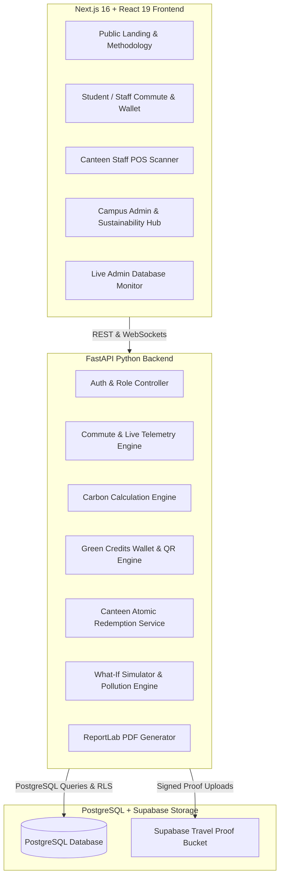

# CarbonLens 360 — Technical Architecture

**Tagline:** “From Carbon Footprint to Carbon Credit.”  
**Architecture Theme:** 2050 Climate Intelligence Campus Operating System

---

## 1. High-Level Architecture Diagram

---

## 2. Core Architectural Pillars

### Pillar A: Multi-Role Experience
1. **Student / Teacher / Staff:** Commute tracking, camera proof, green credits wallet, challenges, rewards.
2. **Team Lead:** Team reduction aggregate metrics, challenge encouragement, team leaderboard.
3. **Canteen Staff (`/canteen`):** Dedicated camera scanner interface, instant QR validation, discount receipt, atomic balance deduction, strict zero-carbon-data privacy.
4. **Campus Admin (`/campus`, `/admin/data`, `/admin/users`):** Campus emissions, transport split, What-If simulator, user inspection with audit logs, and live database monitor.
5. **Sustainability Admin:** Project passports, emission factor overrides, evidence verification, and compliance PDF generation.

### Pillar B: Evidence Chain & Verification
- **Live Camera Stream Only:** Uses `navigator.mediaDevices.getUserMedia` with video element and canvas capture. File uploads and gallery imports are strictly disabled for commute proof.
- **Active GPS Session:** Real-time Haversine distance and speed consistency checks.
- **Campus Geofence:** 1.5 km anchor radius around campus coordinates (`12.9750, 77.6050`).
- **Cryptographic QR Tokens:** 90-second valid tokens with SHA-256 HMAC signatures.

### Pillar C: Data Traceability & Scientific Integrity
- **Baseline Comparison:** Verified reduction calculated against standard passenger car baseline ($0.192\text{ kg CO}_2\text{e/km}$).
- **Green Credits:** Campus reward currency ($100\text{ credits} = 1\text{ kg CO}_2\text{e saved}$ + bonuses).
- **Distinction:** Green Credits (campus perks) are strictly separated from Potential Carbon Credits (institutional project readiness estimates).
