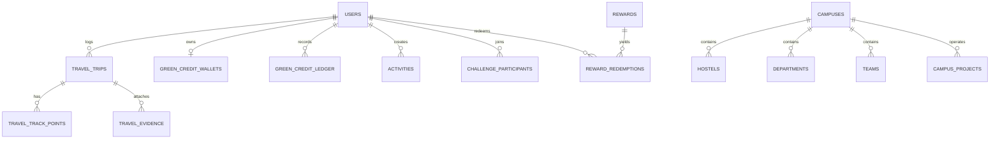

# CarbonLens 360 — Database Schema & Data Modeling

**Source of Truth:** PostgreSQL (Supabase / TablePlus Compatible)

---

## 1. Relational Entity Overview

---

## 2. Primary Tables

### `users` & `profiles`
- `id` (UUID PK), `email` (TEXT UNIQUE), `role` (CHECK: student, teacher, staff, team_lead, campus_admin, sustainability_admin, canteen_staff).
- `full_name`, `campus_id`, `department_id`, `hostel_id`, `team_id`.

### `travel_trips`
- `id` (UUID PK), `user_id` (UUID FK), `travel_mode` (walking, cycling, bus, train, motorcycle, car).
- `distance_km`, `duration_minutes`, `calculated_co2e_kg`, `saved_co2e_kg`, `credits_earned`.
- `verification_status` (VERIFIED, REVIEW_REQUIRED, REJECTED, UNVERIFIED), `campus_geofence_verified` (BOOL), `evidence_confidence_score` (INT).

### `travel_track_points`
- `id` (UUID PK), `trip_id` (UUID FK), `latitude`, `longitude`, `speed_kmh`, `accuracy_m`, `timestamp`.

### `travel_evidence`
- `id` (UUID PK), `trip_id` (UUID FK), `user_id` (UUID FK), `storage_path`, `hash`, `mime_type`, `captured_at`.

### `green_credit_wallets` & `green_credit_ledger`
- `available_credits`, `lifetime_earned`, `lifetime_redeemed`.
- `ledger`: `id`, `user_id`, `amount`, `type` (EARN/REDEEM), `event` (VERIFIED_COMMUTE, CANTEEN_DISCOUNT, CHALLENGE_COMPLETION), `description`, `created_at`.

### `reward_qr_tokens` & `reward_redemptions`
- `token_code` (TEXT UNIQUE), `user_id`, `reward_id`, `credit_cost`, `discount_value_inr`, `expires_at`, `signature`, `is_redeemed`.
- `redemptions`: `transaction_code` (e.g. `CL-TXN-XXXX`), `canteen_location`, `redeemed_at`.

### `campus_projects` & `what_if_scenarios`
- Solar expansion, EV shuttle, smart HVAC projects with baseline, target, measured reduction, and evidence confidence score.

### `audit_logs`
- `actor`, `actor_role`, `action`, `target`, `timestamp`, `metadata`.

---

## 3. TablePlus Connection Guide

To view and query live CarbonLens data via TablePlus:
- **Driver:** PostgreSQL
- **Host:** `localhost` (or Supabase direct connection host)
- **Port:** `5432`
- **Database:** `postgres`
- **User:** `postgres`
- **SSL Mode:** Prefer / Require (for cloud Supabase)
